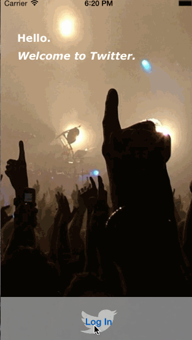

## Twitter

This is a basic twitter app to read and compose tweets the [Twitter API](https://apps.twitter.com/).

Time spent: `10`

### Features

#### Required

#####Hamburger Menu
- [x] Dragging anywhere in the view reveals the menu
- [x] Menu includes links to your profile and the home timeline

#####Profile Page
- [x] Contains user header view
- [x] Contains a section with the user's basic stats
- [x] User can swipe from left edge to close the screen.

#### Optional
- [ ] Allows account switching.
- [ ] Implements paging view for the user description
- [ ] Retweeting and favoriting should increment the retweet and favorite count.

### Walkthrough

